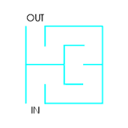

**Maze Solver** 
===========  

This is a game which creates a maze randomly for the user to find the path in the maze and gives the correct path in case of wrong answer from the user.  

----  

### **Introduction** : ###
A maze is a tour puzzle in the form of a complex branching passage through which the solver must find a route from the entrance to the exit. So, this maze solver is an utility which creates a maze for the user of this utility to solve it. The user needs to give the shortest path from the entrance to the exit. In case of wrong answer from the user, it prints the correct answer.  

----  

###**Working of the utility :**###
The user of this utility first needs to give the specifications of the maze i.e the length and the breadth of the maze. Then, the utility prints a maze created by it and asks the user to find the shortest path from the entrance to the exit of the maze.  
The user should give the answer in this format : NWESN... where N stands for moving in the north direction from the current cell to the above cell, W stands for moving in the west direction from the current cell to the left cell, S stands for moving in the south direction from the current cell to below cell and E stands for moving in the east direction from the current cell to the left cell. In case, the user provides a wrong answer, the utility will print the correct answer.  

A maze  
  
The correct answer to the above maze is NNESEENWNENWWSWNN.  

---  

###**Description of the interface :**###
This utility uses a library to create a maze and find its solution. The functions offered by the library are :  
*1. maze(int length, int breadth);*  
    This is the constructor of the class which takes as parameters the length and breadth of the maze to be constructed. Its running time is O(nm) where n is the length and m is the breadth of the maze.  
*2. void print();*  
    This function prints the maze which calls it. Its running time is O(nm) where n is the length and m is the breadth of the maze.  
*3. void shortest_path();*  
    This function finds the shortest path from the entrance of the maze to the exit of the maze in O(nm) time where n and m are the specifications of the maze. It uses the shortest path algorithm which runs in O(V + E) time where V and E is the number of vertices and edges in the graph. Since, in the graph each node can have atmost 4 edges and there are nm cells, the running time is O(nm + 4nm) = O(nm). It also stores the path in a private member.  
*4. void print_path();*  
   It prints the shortest path from the entrance of the maze to the exit of the maze, which is stored in a private member of the class in O(1) time.  
*5. bool is_correct(string answer);*  
   It takes in a string, which is the answer of the shortest path provided by the user of this utility and returns whether it is correct or not in O(1) time.  
*6. void run();*  
   This function first prints the maze for the user using the print() function. It then finds the shortest path using the shortest_path() function. It then takes input of the answer(of the path) from the user and gives the correct answer incase of wrong answer from the user. Its running time is O(nm) where n and m are the length and the breadth of the maze respectively.  
*7. ~maze();*  
    This is the destructor which frees the memory dynamically allocated in constructing the maze.  

---  

### **Description of the internal implementation :** ###
The data structures used are disjoint sets and graphs. Disjoint sets are used to create the maze. In the maze each cell is represented by a node. There are nm cells in the maze, where n and m are the length and the breadth of the maze and hence the number of nodes is nm. The memory used by the disjoint set is O(nm) where n and m are the length and the breadth of the maze.  

A graph structure is used to find the shortest path from the entrance to the exit in the maze. A vector of adjacency lists of nodes is used to store information about the edges in the graph. There is an edge between two cells if and only if there is no wall between them(in the maze). Also, a string is used to store the shortest path from the entrance to the exit in the maze. The memory used by the graph structure is O(nm) where n and m are the length and the breadth of the maze.  

---  

### **Design decisions and their reasons :** ###
In the disjoint set, the heuristics "union by rank" and "path compression" are used for finding and union of sets. This is because the running time then reduces to O(m a(n)) from O(m log n), where a(n) is a very slowly growing function. a(n) <= 4, thus the running time reduces to O(m) from O(m log n), where m is the total number of calls to union(which combines two disjint sets), find_set(which finds the representative of an element) and make(which creates a set with an element in it) functions and n is the total number of elements.  

---  

### **Installation :** ###
1. Download the source code along with the Makefile.  
2. Compile and link the source files by executing the command `make -f Makefile`  
3. Then, play the game by executing the command `./maze`.  